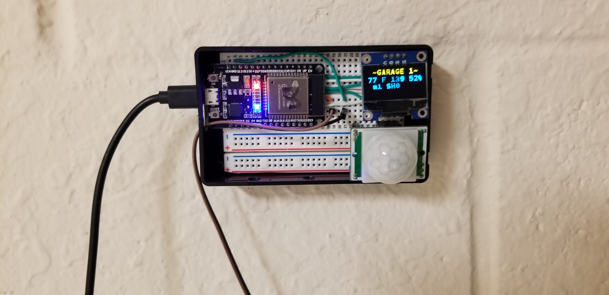
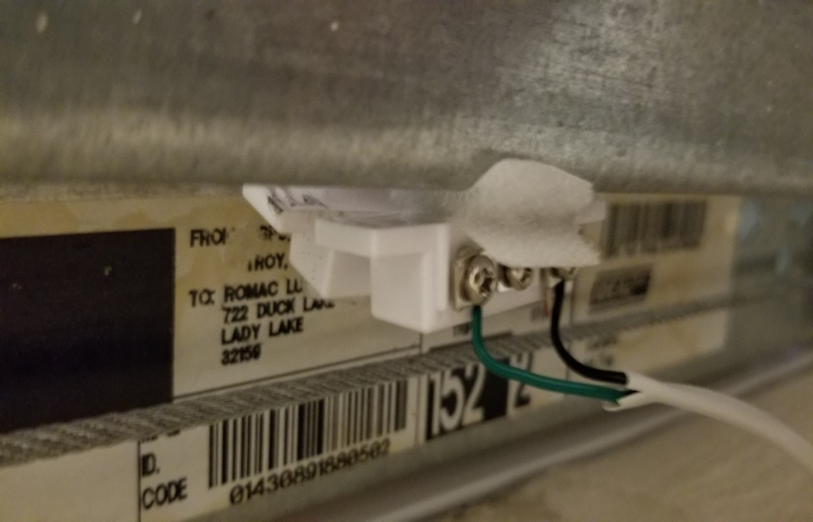
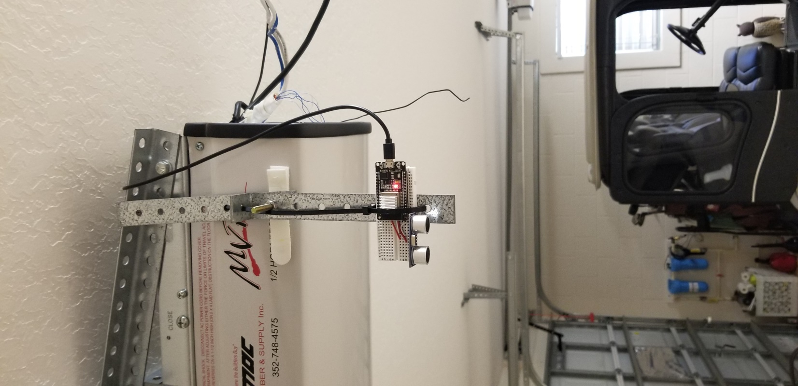
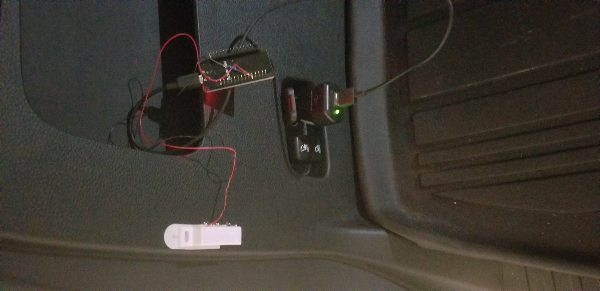
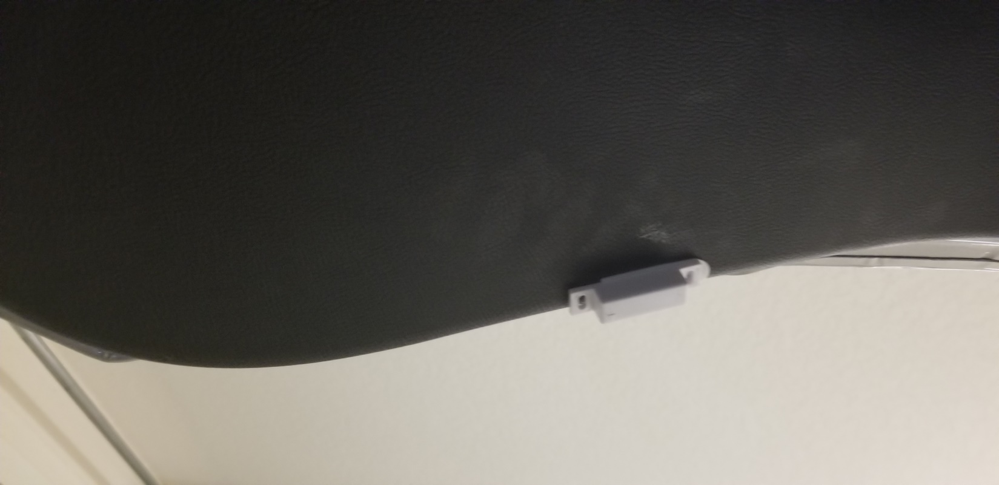
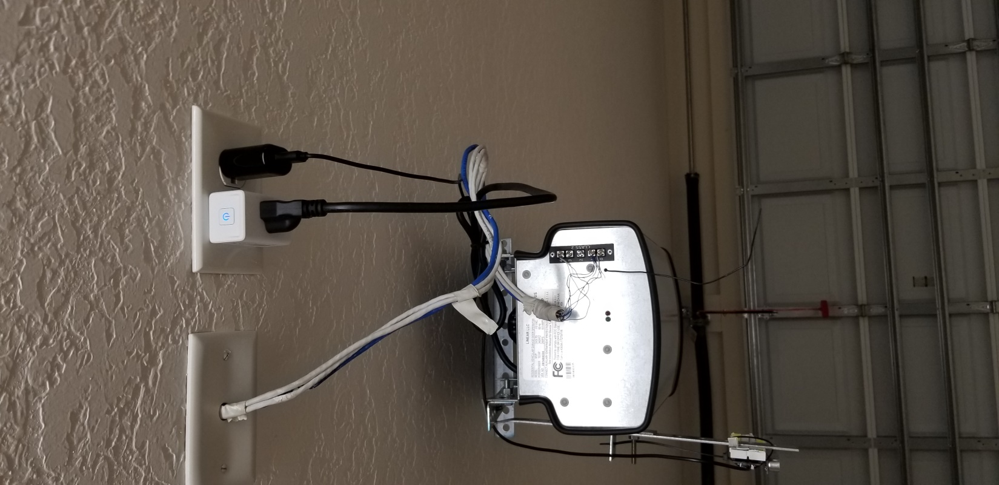
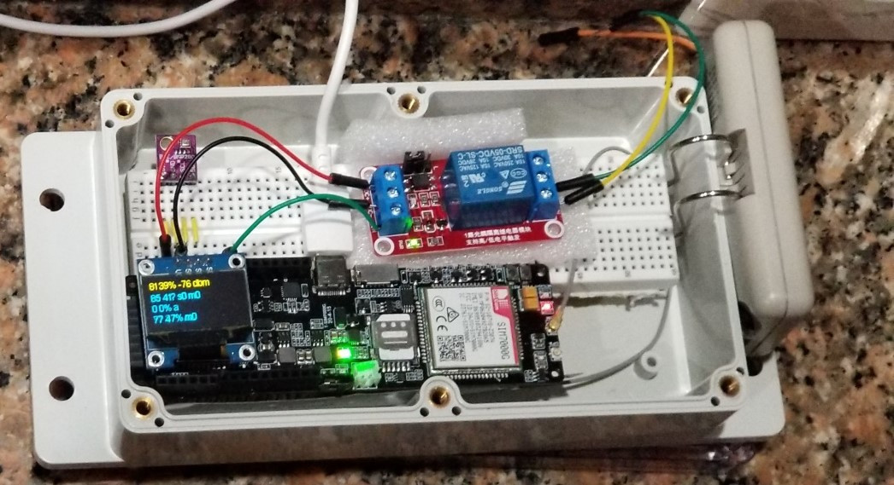

**Prototype Smart Garage System**

Overview

1.  Closes garage door automatically if left open and garage is unoccupied.
2.  Disables garage door when SUV hatch is open to prevent damage to hatch.
3.  Sensors
    1.  Garage door open/closed
    2.  Garage motion
    3.  Garage temperature, humidity
    4.  SUV hatch door open/closed
    5.  Ultrasonic auto presence detector
4.  Actuators
    1.  Kasa smart plug for garage motor
    2.  Lillygo TT-GO Sim7000G Cellular module with wifi is central brain
    3.  Optional Raspberry pi 3B+ with Home Assistant for dashboard and added control
5.  Software features
    1.  Cellphone notification when garage door is opened or closed
    2.  Remote control of garage door from cellphone
    3.  Displays status of all garage sensors via cellular network
        1.  Car present or absent
        2.  Door open or closed
        3.  Car hatch open or closed
        4.  Motion in garage
        5.  Light on/off
        6.  Temperature/Humidity

Implementation

1.  Garage Monitor Components
    1.  ESP32, PIR sensor, temperature/humidity sensor, photodiode, OLED display, shielded cable to garage door reed switch.

        

    2.  Use Velcro to attach one side of the reed switch to the garage door rail, the other side of the switch to the garage door.

        

    3.  Software: The software app GarageDoor.ino reports motion and garage door state as well as light level, temperature, and humidity wirelessly to the Lillygo module via ESPNOW . The software documents the pin connections for the sensors.
1.  SUV Ultrasonic auto monitor

    

2.  eSP32, ultrasonic sensor, bracket measure distance to floor in inches. When car is absent, it reports around 80 inches. When car is present, it reports 15 inches or so.
3.  UltraSonic Software: The software app UltrasonicTapeMeasure.ino as mounted reports distance from ceiling of a reflective surface to the Garage Controller via ESPNOW . The software documents the pin connections for the ultrasonic sensor.
1.  SUV Hatch Sensor

    

    1.  Esp32, Reed Switch mounted just inside hatch.

        

        b. Hatch Software: AutoHatch.ino reports hatch status to the Garage Controller via ESPNOW . The software documents the pin connections for the reed switch.

1.  Kasa smart plug for garage motor is controlled by GarageController

    

1.  GarageController

    

    1.  LillyGo TTGO sim 7000G, Relay, temperature/humidity sensor, garage remote. Open the remote control and tack 2 wires to the switch for connection to the relay.
    2.  Software: GarageControler.ino receives data wirelessly via ESPNOW from GarageDoor.ino, UltrasonicTapeMeasrure,ino, and Hatch.ino. It can open or close the garage door by activating the relay, which simulates pressing the button on the remote control.
2.  Disables garage door if car is present AND hatch is up by signaling the Kasa smart plug.

    ii. Closes garage door if the car is absent AND the garage door is open AND there has been no motion for an hour.
