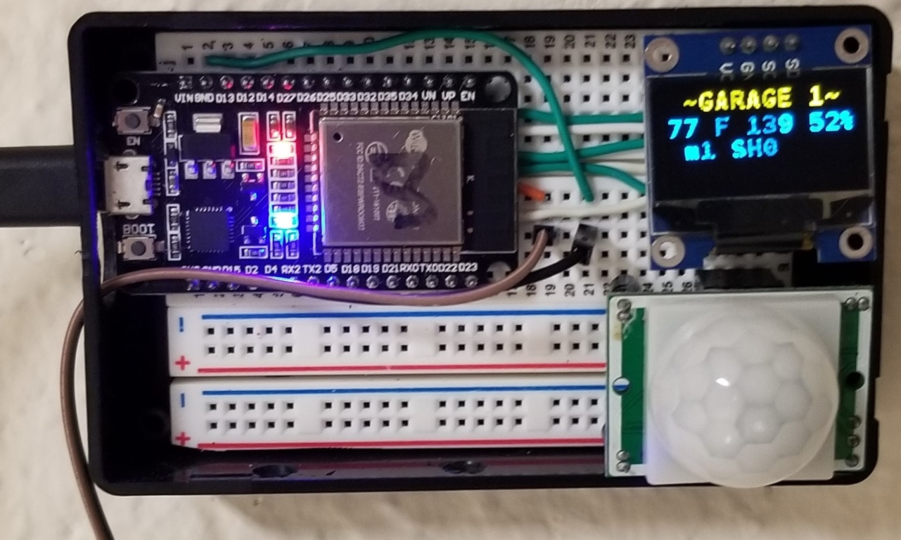
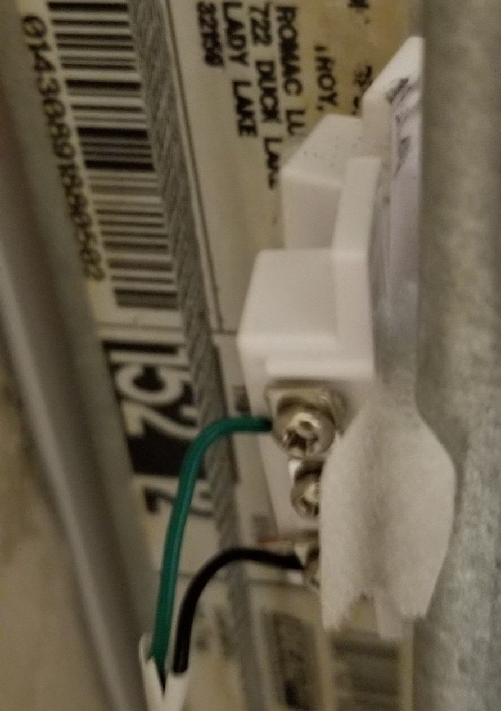
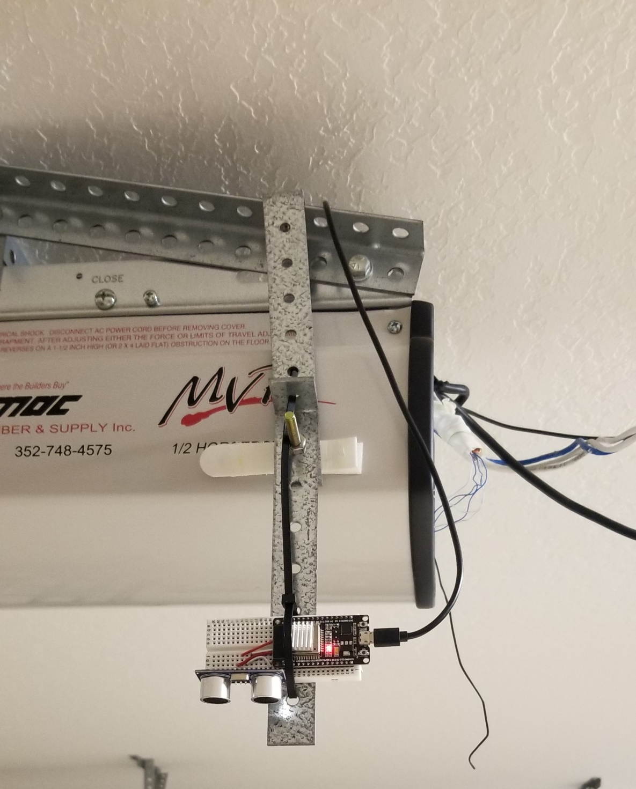
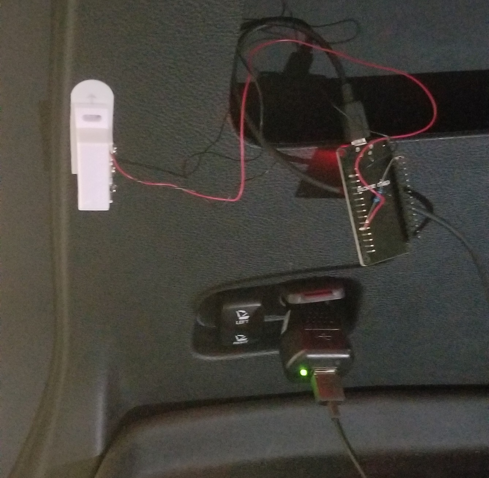
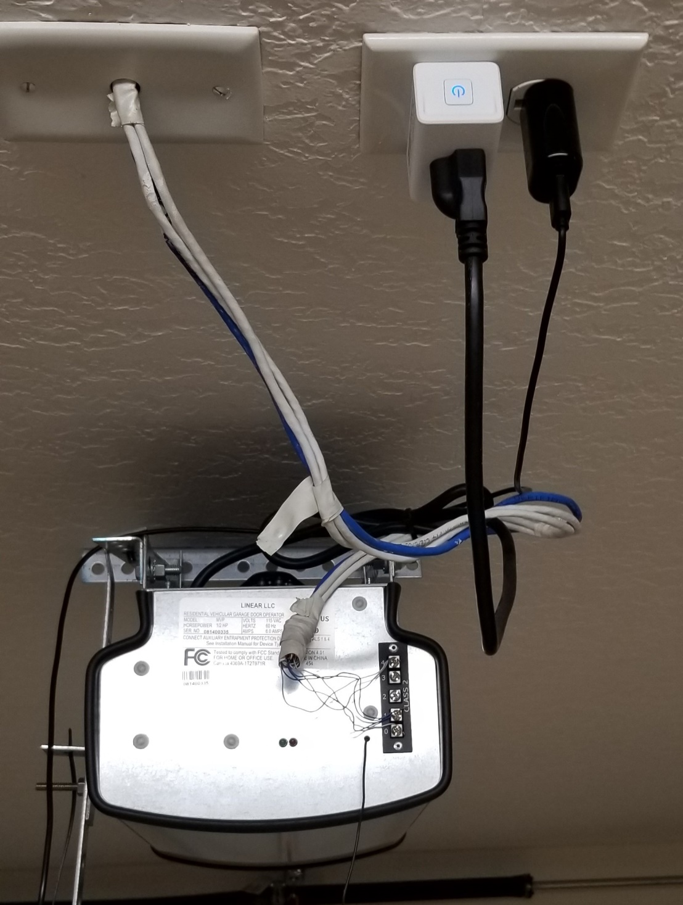
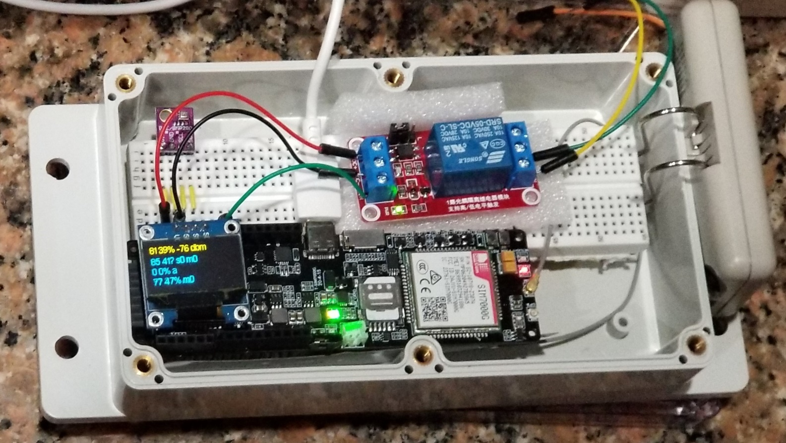

# Prototype Smart Garage System 

Closes garage door automatically if left open and garage is unoccupied.
 
 
Disables garage door when vehicle hatch is open to prevent damage to hatch.
 
 
No wire connection or modification to garage door motor control circuitry.
 
 
Communicates via cellular ioT; no dependence on WiFi
 
 
## Sensors
-   Garage door open/closed
-   Garage motion
-   Garage temperature, humidity
-   Vehicle hatch open/closed
-   Ultrasonic vehicle presence detector
## Actuators
-   Kasa smart plug for garage motor
-   Lillygo TT-GO Sim7000G Cellular module with wifi is central brain
-   Optional Raspberry pi 3B+ with Home Assistant for dashboard and added control
## Software features

-   Arduino C++   
-   Cellphone notification when garage door is opened or closed
-   Remote control of garage door from cellphone
-   Displays status of all garage sensors via cellular network
    -   Car present or absent
    -   Door open or closed
    -   Vehicle hatch open or closed
    -   Motion in garage
    -   Light on/off
    -   Temperature/Humidity

## Garage Monitor Components
-   ESP32
-   PIR sensor
-   temperature/humidity sensor
-   photodiode
-   OLED display
-   shielded cable to garage door reed switch.

    
    

-   Use Velcro to attach one side of the magnetic reed switch to the garage door rail, the other side of the switch to the garage door.

    

-   GarageDoor.ino software reports motion and garage door state, light level, temperature, and humidity wirelessly to the Lillygo module via ESPNOW . The software documents the pin connections for the sensors.

    ### Ultrasonic auto monitor reports whether vehicle is present or not:
    
    

-   eSP32, ultrasonic sensor, bracket measure distance to floor in inches.
-   When vehicle is absent, it reports around 80 inches.
-   When vehicle is present, it reports 15 inches.
-   UltrasonicTapeMeasure.ino software reports to the Garage Controller via ESPNOW.
-   The software documents the pin connections for the ultrasonic sensor.
  
  ###  Vehicle Hatch Sensor reports hatch open or closed state:

-   Esp32, Reed Switch mounted just inside hatch.

    

-   AutoHatch.ino software reports hatch status to the Garage Controller via ESPNOW.
-   The software documents the pin connections for the reed switch.
 
 
    Kasa smart plug is controlled by GarageController to disable power to garage motor when vehicle hatch is open:
    
  
 
 
### GarageController is LillyGo TTGO sim 7000G, ioT SIM card, relay, temperature/humidity sensor, garage remote control:
 
 
    
  
 
 
- Open the remote control and tack 2 wires to the switch for connection to the relay.
   
- GarageControler.ino software receives data wirelessly via ESPNOW from the sensors described above.
   
- Garage door is opened or closed by activating the relay, which simulates pressing the button on the garage remote.
   
   
        -   Disables garage door if vehicle is present AND hatch is up by signaling the Kasa smart plug.
   
   
        -   Closes garage door if the vehicle is absent AND the garage door is open AND there has been no motion for an hour.
