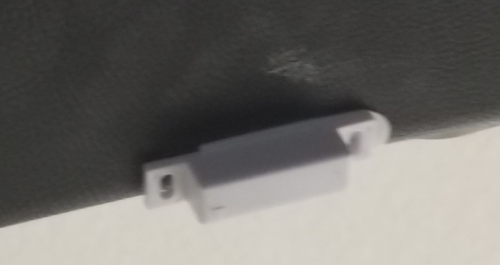

# Prototype Smart Garage System 

-  Closes garage door automatically if left open and garage is unoccupied
-  Disables garage door when vehicle hatch is open to prevent damage to hatch
-  No wire connection or modification to garage door motor control circuitry
-  Communicates via cellular ioT; no dependence on WiFi
## Sensors
-   Garage door open/closed
-   Garage motion
-   Garage temperature, humidity
-   Vehicle hatch open/closed
-   Ultrasonic vehicle presence detector
## Actuators
-   Kasa smart plug for garage motor
-   Garage Controller connects to garage remote to open or close garage door
-   Optional Raspberry pi 3B+ with Home Assistant for dashboard and added control
## Software features
-   Arduino C++, adapted from **Ambient** and **AmbientHUB**  software in the current group of repositories    
-   Cellphone notification when garage door is opened or closed
-   Remote control of garage door from cellphone
-   Reports status of all garage sensors via cellular network
    -   Car present or absent
    -   Door open or closed
    -   Vehicle hatch open or closed
    -   Motion in garage
    -   Light on/off
    -   Temperature/Humidity
    -   The software documents the pin connections for the sensors.

## Garage Monitor Components
-   ESP32 development board
-   PIR sensor
-   temperature/humidity sensor
-   photodiode
-   OLED display
-   shielded cable to garage door reed switch.

    
    

-   Use Velcro to attach one side of the magnetic reed switch to the garage door rail, the other side of the switch to the garage door.

    

-   **GarageDoor.ino** software reports motion and garage door state, light level, temperature, and humidity wirelessly to the Garage Controller via ESPNOW . 

    ### Ultrasonic vehicle monitor reports whether vehicle is present or not:
    
    

-   eSP32 development board, ultrasonic sensor, bracket measure distance in inches.
-   When vehicle is absent, it reports 80 inches.
-   When vehicle is present, it reports 15 inches.
-   **UltrasonicTapeMeasure.ino** software reports to the Garage Controller via ESPNOW.
  
  ###  Vehicle Hatch Sensor reports hatch open or closed state:

-   Esp32 development board, Reed Switch mounted just inside hatch.

    

-   **AutoHatch.ino** software reports hatch status to the Garage Controller via ESPNOW.
 
 
    Kasa smart plug is controlled by the GarageController to disable power to garage motor when vehicle hatch is open:
    
  
 
 
### GarageController is LillyGo TTGO sim 7000G, ioT SIM card, relay, temperature/humidity sensor, garage remote control:
 
 
    
  
 
 
- Open the remote control and tack 2 wires to the switch for connection to the relay.
   
- **GarageControler.ino** software receives data wirelessly via ESPNOW from the sensors described above.
   
- Garage door is opened or closed by activating the relay, which simulates pressing the button on the garage remote.
   
   
        -   Disables garage door if vehicle is present AND hatch is up by signaling the Kasa smart plug.
   
   
        -   Closes garage door if the vehicle is absent AND the garage door is open AND there has been no motion for an hour.
